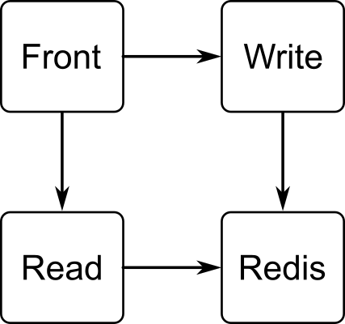

#  Desafio DevOps jr PicPay

## Visão Geral

Este projeto consiste em três serviços: um serviço de escrita (Python), um serviço de leitura (Go) e um serviço de frontend (JavaScript). Os serviços são orquestrados usando Docker Compose. Abaixo estão as mudanças recentes feitas em cada serviço e na configuração geral do Docker Compose.

## Serviço de Escrita (Python)

### Alterações:
1. **Criação do `requirements.txt`**:
    - Adiciona a biblioteca `redis` que estava faltando.

2. **Atualização do `Dockerfile`**:
    - Adição do comando para instalar as dependências.
    - Modificado o comando `CMD` para garantir a execução correta.

## Serviço de Leitura (Go)

### Alterações:
1. **Criação do `go.mod`**:
    - Adicionado para gerenciar as dependências do Go.

2. **Reescrita do `Dockerfile`**:
    - Modificado para copiar o `go.mod`.
    - Instalar as dependências.
    - Expor a porta e executar o programa.

3. **Atualização do `main.go`**:
    - Alterados os argumentos para a função `client.Get`.

## Serviço de Frontend (JavaScript)

### Alterações:
1. **Atualização do `Dockerfile`**:
    - Mudança da porta de `5000` para `3000`.
    - Removidas as aspas do comando `serve` na linha `CMD`.

## Docker Compose

### Alterações:
1. **Porta do Frontend**:
    - Mudança de `5000` para `3000`.
2. **Correção de Typo**:
    - Corrigido `reids` para `redis`.
3. **Adição de Rede**:
    - Adicionada a configuração de rede que estava faltando.

## Como Executar

Para executar o projeto, use Docker Compose:
```bash
docker-compose up --build
```

## Diagrama do Projeto


## Nota

O desafio deste projeto foi o serviço de leitura, pois eu não conhecia a linguagem Go. Tive que estudá-la para entender o que estava errado e fazer as alterações necessárias.

## Link para o Repositorio do Desafio
[Repositorio](https://github.com/PicPay/picpay-jr-devops-challenge)
